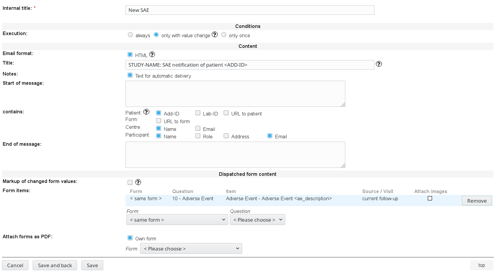

# Create a SAE notification

``` diff
 Note: If you have two separate forms for AE and SAE 
       then follow the recipe “Create email notifications” 
       → “Emails for specific forms”). If the SAE documentation
       is included within the AE-form then perform the 
       following steps.
```

In the **FormBuilder**:


1. Select your AE-form, check the “Is a SAE” checkbox

2. Navigate to the item (e.g. radiobutton) which indicates if an SAE is being registered

3. New rule → Generate message if  → “Rule name: New SAE” → New or condition → own item → = equal value → fixed integer → yes

4. Under Message “Define New”:

  * Internal Title: “New SAE”
  * Execution “only with value changed”
  * Check HTML
  * Title:  “STUDY-NAME: SAE Notification of Patient <ADD-ID>”
  * Deselect Lab-ID
  * Select Email
  * Under “Form items” →  Questions → select Adverse Event→ Adverse Event Desription
  Make sure to push the “Add” button! (This will deliver the AE description in your Email notification)
  * Attach forms as PDF: check “Own form” 


  
``` diff
 Note: Proceed in the same way for the AE notifications in 
       case you need it. But normally you will only need 
       the SAE notification.
 ```

# Create an AE notificatioin

1. Navigate to the item (e.g. radiobutton) which indicates if an SAE is being registered

2. New rule → Generate message if  → “Rule name: New SAE” → New or condition → own item → = equal value → fixed integer → no

3. Under Message “Define New”: Proceed as for SAE and replace the word SAE by AE.

 
In the **AdminTool**:

1. Select the "Ressources" tab
2. Select your project and check the notifications you want to send
3. Select: “Versenden als” →  interne Nachricht →  
Select your project →  Email an alle Teilnehmer des Projektes →  Select the role that should receive the message

  
