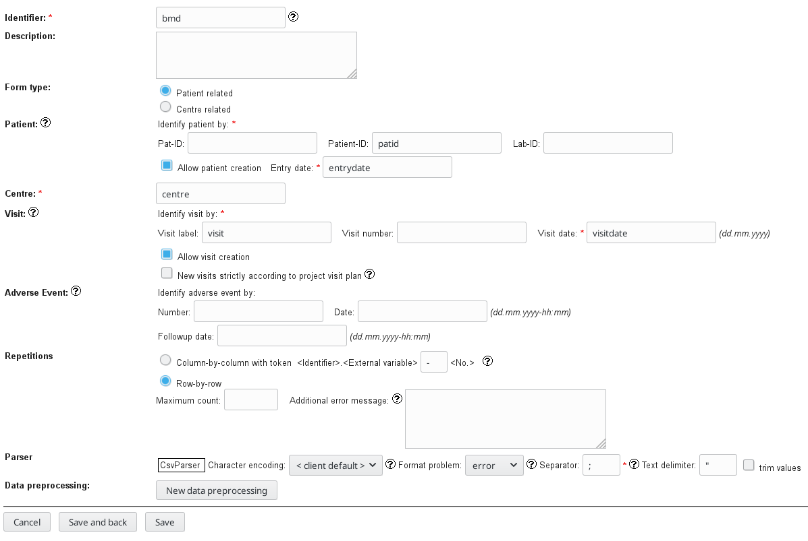
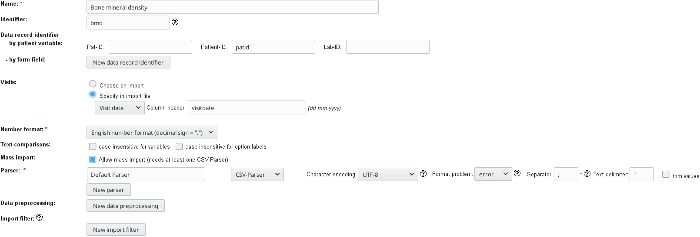

# secuTrial data import

In most cases data will be manually entered into the eCRF. However, in some cases
batch data needs to be imported. Data imports are specified in the FormBuilder.
This recipe outlines one way to set up a data import into secuTrial. Other set ups
are also possible.

```
 Note: It is strongly suggested to perform data imports 
       with extreme caution. Any data already entered 
       for a specific patient and visit combination 
       explicitly and differently specified by the import
       file will be overwritten and lost. Hence, empty 
       fields and columns in the import file can cause
       deletion of previously entered data.
```

An importable example project is available [here](https://github.com/SwissClinicalTrialOrganisation/DM_secuTrial_data/blob/master/proj_DEM00_Dev_20180910-1701_BONE_MINERAL_DENSITY.zip).

### Configuring the import in the FormBuilder
1. select "Edit import configurations"
2. "New import configuration"
3. configure your import according to the example below

    

4. Navigate to the form implementation for which you would like to perfom an import

    

5. select "Edit import formats"
6. "New import format"
7. configure your import format according to the example below

    

```
 Note: In this example we are not setting up "mapping 
 entries". If you have coded data you are importing 
 you will need to explicitly map the coding to the 
 secuTrial values. Alternatively you can decode your 
 data before importing it.
```

### Data praparation in R

In order to import data you need to transfer it into a format that is compatible with how you have configured your import routines in secuTrial. For the bone mineral density (bmd) example a short segement of code that prepares the data for import into secuTrial is available [here](https://github.com/SwissClinicalTrialOrganisation/DM_secuTrial_R/blob/master/demo/secuTrial_lib_demo.R#L2-L52).

```
 Note: In the header of the produced file 
 (calcium_secuTrial.csv) the data to be entered into
 the form is labelled with "bmd.". This marker refers 
 to the "bmd" specified in in the import format of 
 the form (i.e. point 7 further up in this text).
```

### Importing your data in the DataCapture

```
 Note: Large imports may crash your system depending on the
 amount of resources you have allocated. Import files can
 be chunked into smaller files and uploaded bit by bit. 
 Every file needs the same header.
```

1. select "Import" on the top right
2. select "Form data for multiple forms"
3. select your "Project" and "Import configuration" (e.g. "BONE MINERAL DENSITY" and "bmd")
4. select the file for upload (e.g. "calcium_secuTrial.csv")
5. select "UTF-8" encoding
6. "Upload"
7. check to small "Preview" if it makes sense
8. "Analyze"
9. Ideally all records are "Successful". "With warnings" or "Erroneous" records should be traced and fixed if possible.
10. "Save"
11. Ideally all records are "Successful". "With warnings" or "Erroneous" records should be traced and fixed if possible.


