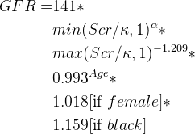
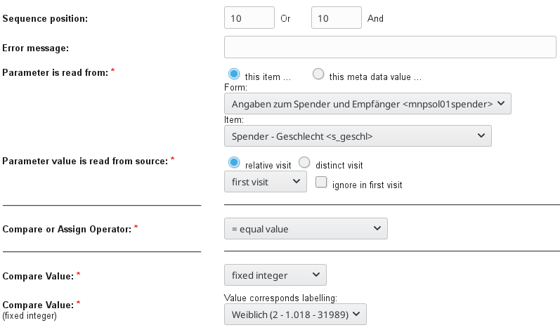
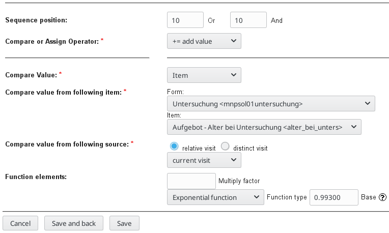
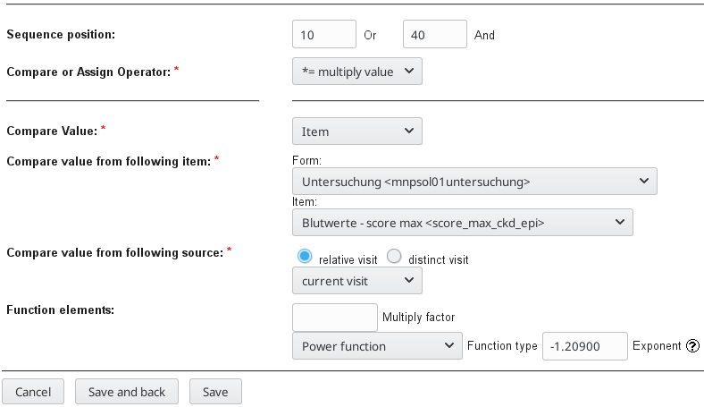

# secuTrial score implementation

This manual assumes that you are generally familiar with the secuTrial FormBuilder and are now attempting to implement 
somewhat complex scores.

```
 Note: Starting from secuTrial version 5.5.0.10 a 
       "Score Assistant" is available.
```

Introduction to the formula
------

The implementation of a secuTrial score will be demonstrated in this recipe based on the 
Glomerular Filtration Rate (GFR) calculation with CKD-EPI (Chronic Kidney Disease Epidemiology Collaboration).

<!---
https://www.codecogs.com/latex/eqneditor.php

formula source code

\begin{align*}
\\GFR {} = {}
& 141 * \\
& min(Scr/\kappa,1)^\alpha * \\
& max(Scr/\kappa, 1)^{-1.209} * \\
& 0.993^{Age} * \\
& 1.018 [\text{if } female] * \\
& 1.159 [\text{if } black]
\end{align*}
-->

The formula is defined as:



As you can see the formula is made up of several variable parts that depend on the age, gender and skin color. 
Thus, *kappa* is 0.7 for females and 0.9 for males. Furthermore, *alpha* is -0.329 for females and -0.411 for males.
*Scr* defines the serum creatinine level, which is entered as mg/dL.

Implementation in secuTrial
------

Within a secuTrial "Question" a "New item" needs to be created. The type of the item must be "Score". Since the formula centrally differentiates between females and males two "New rules" &rarr; "Calculate score function from ..." need to be created. 
<br><br><br>

<br><br><br>
The first rule's "Precondition" should be set to recognise if the gender is female (see below image). Equivalently, the second rule's "Precondition" should be set to recognise if the gender is male. 
<br><br><br>

<br><br><br>
Thus, the setup now allows to calculate separate scores for females and males. This can be considered as an if-condition that checks for the gender (see red text in above image). 

To calculate the final CKD-EPI score, several helper scores need to be implemented first. These helpers can be considered as temporary results which are needed to calculate the individual components of the final CKD-EPI.

Only the adjustment of the serum creatinine unit from umol/L to mg/dL and its division by *kappa* will be explained in detail here: <br>
For this example we assume that serum creatinine is entered into the database in umol/L. CKD-EPI, however, expects it in mg/dL.
Since we include the gender specific variable *kappa* we need to create a male and female specific rule like we did above 
(we use "Calculate score from ..." instead of "Calculate score function from ..." here). <br>
After the preconditions for male and female have been set, a "New or condition" needs to be set in "Execution conditions".
First "+= add value" is set to the serum creatinine value. Then "\*= multiply value" is added with "New and condition". 
The "fixed decimal" multiplication factor is 0.011312 which transforms serum creatinine from umol/L to mg/dL. 
This is a serum creatinine specific factor. Finally, "/= divide value" is set as another and condition and the "fixed decimal"
is specificed as 0.7 (female) or 0.9 (male).


The calculation of the other helper scores (i.e. min, max, skin color specific factor) should be evident by abstracting from the specific examples that have been provided up to here.

After all helper scores have been implemented they can be merged to the CKD-EPI score. 


Please note: the helpers all use "Calculate score from ..." while the final CKD-EPI uses "Calculate score function from ...". This is important because "Calculate score function from ..." allows to specify "Power functions" and "Exponential functions".

The calculation of CKD-EPI starts with "+= add value" in which 0.993 is raised to the power ("Exponential function") of the age (see top formula).



The further components are added with "\*= multiply value" and the results of the min and max helper functions need to use "Power function".



